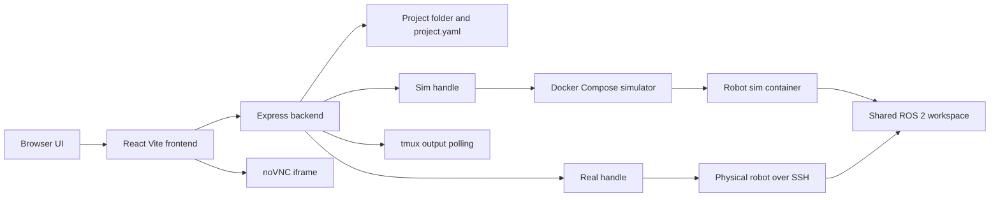
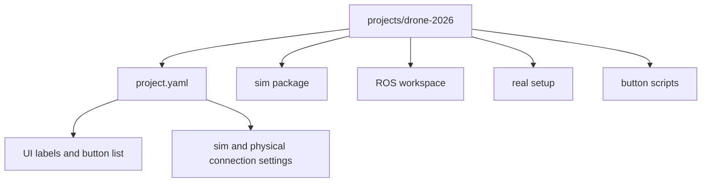
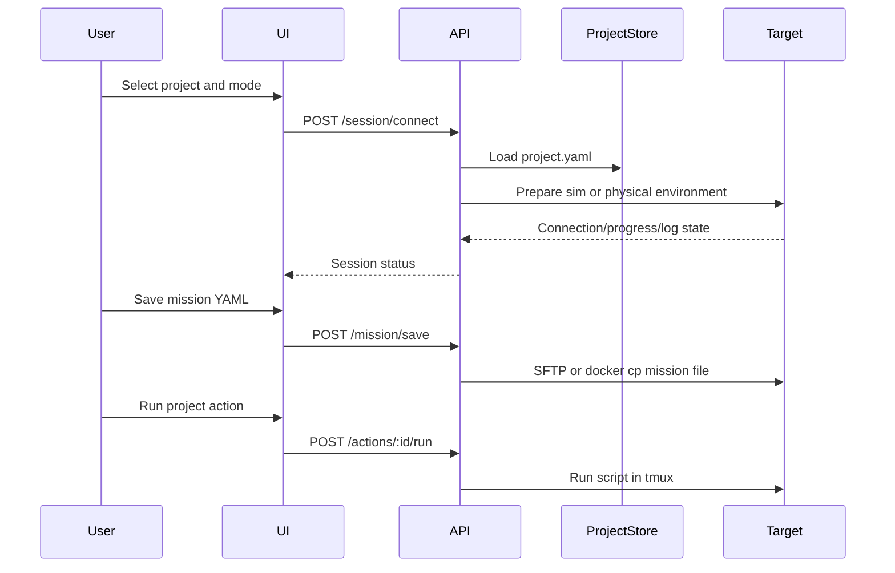

# Elytra Bridge Architecture Roadmap

Elytra Bridge is a local middleware UI/backend for sim-to-real robot development. The first milestone intentionally stays close to the working `drone-2026` application so the drone workflow can be verified before the platform becomes fully generic.

## MVP Goal

The MVP should let a user select the bundled `drone-2026` project, choose either physical or simulation mode, edit mission YAML, start and stop the robot workflow, view tmux output, and see a noVNC simulator stream when running locally through Docker.

The first version is not trying to solve every robot shape. It creates the smallest project-aware layer around the known drone workflow so later robot packages, simulator packages, and real setup packages have a stable place to attach.

## Runtime Architecture

The backend owns orchestration. It loads project metadata, prepares the selected environment, sends files or commands to the active target, and reports progress/log state back to the UI.

## Project Folder Model

Each project is a folder that can be copied, versioned, and opened later. The MVP keeps the descriptor intentionally simple:

- `id`, `name`, `robotType`, and `ros.distro`.
- `sim`: Docker Compose file, container name, noVNC URL, mission paths, tmux session, and script paths.
- `real`: SSH host/user/key settings, mission paths, tmux session, and script paths.
- `buttons`: UI labels mapped to action ids and script paths.

## MVP Scope

- React + Vite frontend and Express backend under `application/`.
- File-backed project discovery from `projects/*/project.yaml`.
- A bundled `drone-2026` project descriptor.
- Physical mode over SSH/SFTP/tmux.
- Simulation mode through Docker Compose plus `docker exec` and `docker cp`.
- Mission YAML editing and save.
- noVNC iframe for simulator viewing.
- tmux output polling.
- Startup progress reporting.
- Custom project action buttons rendered from project metadata.

## MVP Non-Goals

- Full upload/import UI for arbitrary robot packages.
- Multi-project concurrent sessions.
- ROS 1 Noetic compatibility.
- Simulator template library for Isaac Sim, Gazebo, Habitat Sim, and variants.
- Cloud execution or remote multi-user deployment.

## Data Flow

## Roadmap

1. Drone parity MVP: preserve the `drone-2026` operator workflow and prove the new repo can control the same sim/real handles.
2. Generic project APIs: introduce project/session/action endpoint names while keeping drone-compatible aliases for existing UI behavior.
3. Project validation: check descriptor schema, required files, executable scripts, Docker availability, SSH connectivity, and ROS distro assumptions.
4. Import workflow: let users add simulator packages, robot sim packages, ROS workspaces, real setup packages, and button scripts through the UI.
5. Multiple sessions: isolate ports, compose project names, tmux sessions, and runtime state so two projects can run at once.
6. Simulator library: add reusable simulator bases for Gazebo, Isaac Sim, Habitat Sim, and future backends.
7. ROS compatibility: keep ROS 2 Jazzy as the default path, then add ROS 1 Noetic compatibility where the project descriptor requests it.

## Design Constraints

- Favor drone workflow parity in the first implementation.
- Treat the ROS workspace as the master copy shared by sim and real.
- Keep user actions environment-neutral: the selected target prepares the environment, then the action launches the configured script.
- Store project data in folders so projects can be switched, copied, and eventually run concurrently.

