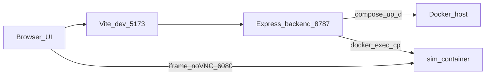

# Local simulation (Docker SITL + web app)

This guide describes how to run the **software-in-the-loop** stack used by the drone control web app. It assumes introductory familiarity with a terminal but explains terms when they first appear.

## Terms

| Term | Meaning |
|------|---------|
| **Docker** | A tool that runs **containers**: isolated Linux environments with their own filesystem and processes. |
| **Container** | A running instance built from an **image** (a saved filesystem snapshot). |
| **Docker Compose** | A way to declare one or more containers (services), ports, and build steps in a YAML file (`docker-compose.yml`). The backend runs `docker compose up -d` to start the simulation service. |
| **Port** | A number that identifies a network endpoint on your machine. The browser uses ports like `5173` (frontend) and `8787` (backend). UDP ports carry MAVLink traffic to/from the simulator. |

## What runs where

When you choose **Local simulation (Docker SITL)** in the web app and connect:

1. **Backend** ([`application/backend`](../application/backend)) starts (or rebuilds) the Compose stack defined by [`SITL/web-sim/docker-compose.yml`](../SITL/web-sim/docker-compose.yml).
2. The **sim container** runs PX4 SITL, Gazebo (GZ), ROS 2 Jazzy, MAVROS, tmux sessions for scripts, TigerVNC + **noVNC** so you can see the desktop in the browser iframe.
3. The backend talks to mission code inside the container using **`docker exec`** and **`docker cp`** (not SSH over the network), even though some settings are named `SIM_SSH_*` for historical symmetry with physical-drone mode.



## Prerequisites

- **Node.js 20+** and **npm**
- **Docker Desktop** (Windows, macOS, or Linux) with Docker **running** (whale icon idle / `docker version` succeeds)
- Enough **disk space** for the image build (on the order of tens of gigabytes depending on layers and cache)
- **RAM**: simulation workloads are heavy; close other large apps if the container exits unexpectedly

On **Windows**, prefer Docker Desktop with the **WSL 2** backend.

## Step-by-step setup

1. **Install** Node.js and Docker Desktop using vendor installers.

2. **Clone** this repository and keep the normal folder layout (`drone-2026/application`, `drone-2026/SITL/web-sim`, etc.). The backend resolves the Compose file relative to its source tree by default ([`application/backend/src/config.js`](../application/backend/src/config.js)).

3. **Configure the backend environment:**
   - Copy [`application/backend/.env.example`](../application/backend/.env.example) to `application/backend/.env`.
   - For a standard clone on one machine, you often **do not need to change** simulation paths: defaults point at `SIM_*` paths inside the container (`/home/sim/drone_workspace/drone-2026/...`).
   - Set **`SIM_COMPOSE_FILE`** only if you moved `docker-compose.yml` or symlinked the repo unusually—otherwise leave unset so the default `SITL/web-sim/docker-compose.yml` is used.

4. **Install npm dependencies** once:

   ```bash
   cd application
   npm install
   ```

5. **Start the web app:**

   ```bash
   npm run dev
   ```

   Or run a launcher from [`scripts/run-simulation-ui/`](../scripts/run-simulation-ui/):  
   `run-simulation-ui.bat` or `run-simulation-ui.ps1` on Windows, `run-simulation-ui.sh` on macOS/Linux (checks Docker + Node, installs npm deps if needed, opens the browser).

6. Open **http://localhost:5173** (frontend). The API defaults to **http://localhost:8787** (see [`application/frontend/.env.example`](../application/frontend/.env.example)).

7. In the UI, select **Local simulation (Docker SITL)** and click **Start + Connect Simulation**.

The **first** connect may **build** the Docker image (long-running). Subsequent starts are faster when layers are cached.

## Ports

| Port | Protocol | Purpose |
|------|-----------|---------|
| 5173 | TCP | Vite dev server (frontend) |
| 8787 | TCP | Express API (backend) |
| 6080 | TCP | noVNC web viewer (embedded iframe in sim mode) |
| 5900 | TCP | TigerVNC inside container (proxied via noVNC) |
| 14540 | UDP | MAVROS ↔ PX4 (typical sim wiring; see `.env`) |
| 14550 | UDP | MAVLink (e.g. GCS forwarding; see Compose file) |

If something else binds these ports on your host, stop that program or adjust Compose/backend `.env` in a coordinated way.

## Environment variables (simulation)

Copy from [`.env.example`](../application/backend/.env.example). Common operators:

| Variable | Typical action |
|----------|----------------|
| `SIM_COMPOSE_FILE` | Leave unset unless Compose file is not at the repo default path. |
| `SIM_COMPOSE_PROJECT` | Optional Docker Compose project name override. |
| `SIM_CONTAINER_NAME` | Must match `container_name` in Compose (`drone-2026-sim` by default). Backend uses this for `docker exec` / `docker cp`. |
| `SIM_NOVNC_ORIGIN` | URL shown in the iframe for the live desktop (default `http://127.0.0.1:6080/...`). Change if you tunnel or proxy noVNC. |
| `SIM_DRONE_MISSION_EXTRA_ARGS` | Extra ROS launch arguments in sim (default enables camera stack with `camera_backend:=sim`). |
| `SIM_AUTOSTOP_ON_DISCONNECT` | If `1`, tears down Compose when switching away from sim mode on disconnect. |
| `SIM_SSH_*` | Naming legacy: backend **does not** open a TCP SSH session for sim control; control uses Docker. Values still appear in managed env UI for parity with physical mode. |

Physical-drone keys (`DRONE_*`) apply only when **Physical drone** mode is selected.

## ROS workspace and simulation camera

Mission nodes and launches live under [`ros_workspace/`](../ros_workspace/). High-level architecture is in [`ros_workspace/design_doc.md`](../ros_workspace/design_doc.md).

For the simulated gimbal image path, see [`passive_camera.launch.py`](../ros_workspace/src/uav_mission/launch/passive_camera.launch.py): with `camera_backend:=sim`, a bridge waits for Gazebo topics and republishes images for `camera_node`.

## Other SITL docs in this repo

- [`SITL/README.md`](../SITL/README.md) describes an **older manual** workflow using `SITL/simulator/`. The **web app** path is **`SITL/web-sim/`**.
- [`MACOS-SITL/README.md`](../MACOS-SITL/README.md) covers an alternate ARM macOS-focused image.

## Troubleshooting

| Symptom | What to try |
|---------|--------------|
| **Docker not running** | Start Docker Desktop; wait until `docker version` works in a terminal. |
| **Connect hangs or fails on first try** | First build is slow; watch Docker Desktop **Build / Containers**. Ensure sufficient disk space. |
| **Windows networking oddities** | Confirm WSL 2 backend; reboot after Docker updates if ports fail to bind. |
| **`docker compose` errors about compose file** | Verify repo layout; set `SIM_COMPOSE_FILE` to an absolute path of [`docker-compose.yml`](../SITL/web-sim/docker-compose.yml). |
| **Host firewall prompts for UDP** | Allow Docker/your terminal through the firewall when prompted so MAVLink UDP ports work. |
| **Rebuild loop / CRLF messages in logs** | The backend may detect Windows line endings in scripts and trigger an image rebuild; ensure clones use LF where documented (`git config core.autocrlf`). |

If problems persist, capture Docker Compose logs (`docker compose -f SITL/web-sim/docker-compose.yml logs`) and the backend console output from `npm run dev`.
